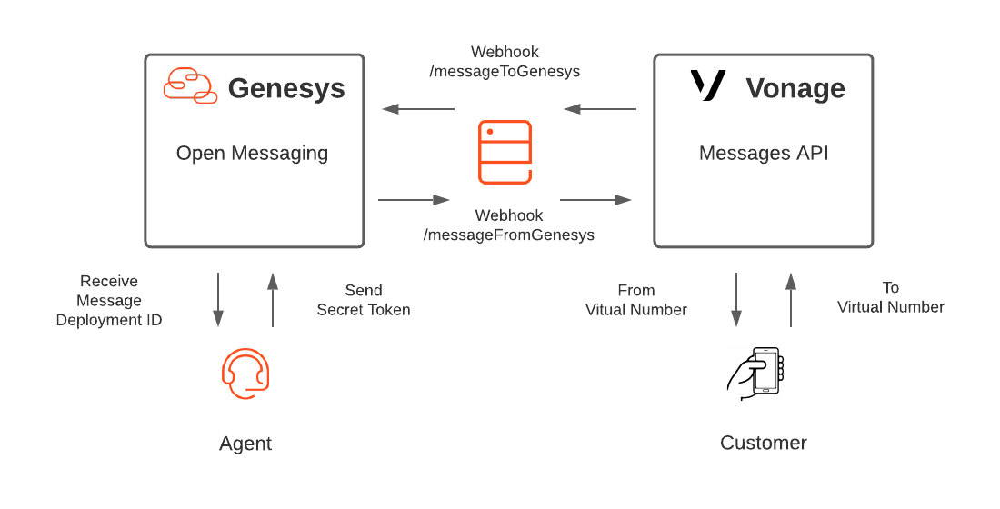

# Configure Genesys Cloud for two way messaging using Open Messaging Platform and Vonage Messages API

> This Genesys Cloud Developer Blueprint provides instructions to configure a middleware to allow a Genesys Cloud Agent to send and receive messages from a Vonage Virtual Number (LVN), using the Open Messaging Platform and Vonage Messages API.

